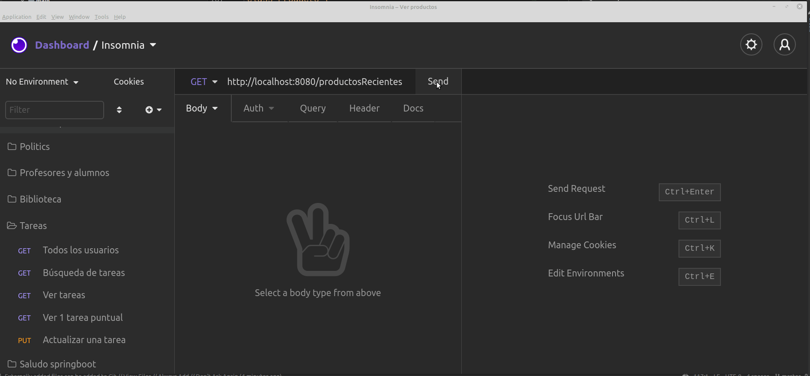
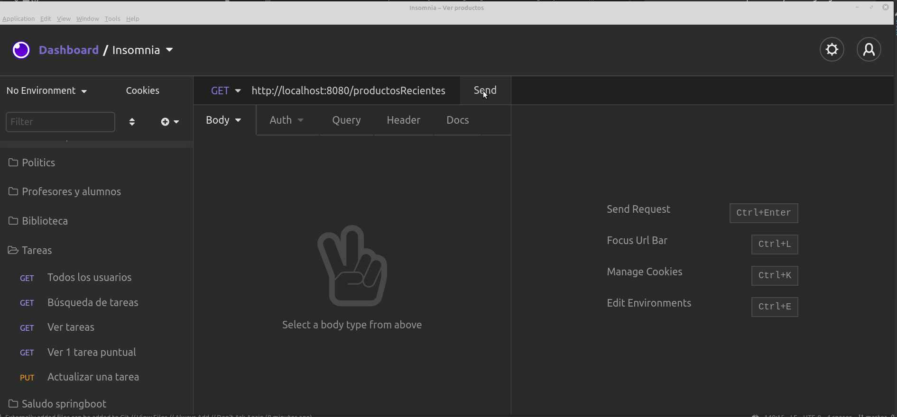
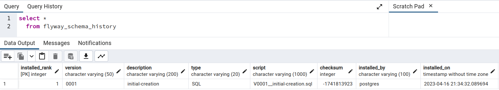

# Productos (problema N + 1 queries)

[](https://github.com/uqbar-project/eg-products-springboot-kotlin/actions/workflows/build.yml) [](https://codecov.io/gh/uqbar-project/eg-products-springboot-kotlin)

Este ejemplo permite ver el problema de los (N + 1) queries. Consiste en un servicio REST hecho con Spring Boot, que tiene un solo endpoint: el que permite consultar los productos más recientes.

## Prerrequisitos

Solo hace falta tener instalado Docker Desktop (el pack docker engine y docker compose), seguí las instrucciones de [esta página](https://phm.uqbar-project.org/material/software) en el párrafo `Docker`.


```bash
docker compose up
```

Eso levanta tanto PostgreSQL como el cliente pgAdmin, como está explicado en [este ejemplo](https://github.com/uqbar-project/eg-manejo-proyectos-sql).

La conexión a la base se configura en el archivo [`application.yml`](./src/main/resources/application.yml):

```yml
  datasource:
    url: jdbc:postgresql://0.0.0.0:5432/products
    username: postgres
    password: postgres
    driver-class-name: org.postgresql.Driver
```

- `0.0.0.0` apunta a nuestro contenedor de Docker
- el usuario y contraseña está definido en el archivo `docker-compose.yml`

## Dominio

Tenemos productos y fabricantes, que cumplen una relación many-to-many: un producto tiene muchos fabricantes y un fabricante ofrece muchos productos. No hay relación en cascada: el producto y el fabricante tienen ciclos de vida separados.

## Generación del juego de datos

La clase **ProductosBootstrap** genera el juego de datos inicial cuando no hay fabricantes:

- construye una lista de 500 fabricantes
- y 15000 productos: a la mitad les pone los primeros 10 fabricantes y a la otra mitad les asigna los fabricantes ubicados en las posiciones 11, 12, 13, 14 y 15

## Endpoint que trae los productos recientes

El único endpoint que publica el web server es `/productosRecientes`, que implementa el método GET y llama al service para obtener los productos más recientes:

```kt
@Transactional(Transactional.TxType.NEVER)
fun buscarProductosRecientes() =
    productoRepository
        .findAll(PageRequest.of(0, PRODUCT_PAGINATION_AMOUNT, Sort.Direction.ASC, "fechaIngreso"))
        .map { ProductoDTO.fromProducto(it) }
```

Dado que tenemos una gran cantidad de productos, decidimos paginar los resultados que envía el repositorio:

`.findAll(PageRequest.of(0, 5, Sort.Direction.ASC, "fechaIngreso"))` trae los primeros 5 resultados ordenados por fecha de ingreso en forma ascendente. Para poder trabajar con paginación debemos definir el repositorio extendiendo de la interfaz `PagingAndSortingRepository`, además de la tradicional `CrudRepository` que nos provee el método save:

```kt
interface ProductoRepository : PagingAndSortingRepository<Producto, Long>, CrudRepository<Producto, Long> {
```

## Configuración EAGER

Podemos ver cómo está definido el mapeo del objeto de dominio Producto:

```kt
@Entity
class Producto {

    @Id
    @GeneratedValue(strategy = GenerationType.AUTO)
    var id: Long? = null

    ...
    
    @JsonIgnore
    @ManyToMany(fetch = FetchType.EAGER)
    var fabricantes: Set<Fabricante> = mutableSetOf()
```

Mmm... si los fabricantes se anotan con FetchType EAGER, esto significa que cada vez que tomemos los datos de un producto también estaremos trayendo los proveedores. En versiones anteriores, se producía

- un primer query que traía todos los productos

```sql
-- Hibernate: query del producto  
    select
        producto0_.id as id1_1_,
        producto0_.fechaIngreso as fechaIng2_1_,
        producto0_.nombre as nombre3_1_ 
    from
        Producto producto0_ 
    order by
        producto0_.fechaIngreso asc limit ?
```

- y por cada producto, un query que baja la información de sus fabricantes (el temido **n**, la lista de productos que paginados pueden ser 5... o 1000)

```sql
-- Hibernate: query 1 del fabricante 
    select
        proveedore0_.Producto_id as Producto1_2_0_,
        proveedore0_.proveedores_id as proveedo2_2_0_,
        fabricante1_.id as id1_0_1_,
        fabricante1_.nombre as nombre2_0_1_ 
    from
        Producto_Fabricante proveedore0_ 
    inner join
        Fabricante fabricante1_ 
            on proveedore0_.proveedores_id=fabricante1_.id 
    where
        proveedore0_.Producto_id=?
```

> Este tipo de inconveniente se llama N + 1 query, porque para N productos se hacen N + 1 llamadas. A partir de la versión 3.4 Springboot solucionó este problema y hace una llamada sola, aunque la desventaja de traer todo el grafo de un producto con sus fabricanes sigue existiendo.

## Lazy es la solución... o casi

Podemos pensar entonces que si configuramos la relación producto-fabricantes como lazy, habremos resuelto nuestro problema:

```kt
@Entity
class Producto {
    ...

    @JsonIgnore
    @ManyToMany(fetch = FetchType.LAZY)
    var fabricantes: Set<Fabricante> = mutableSetOf()
```

Pero si volvemos a levantar la aplicación, nos vamos a llevar una sorpresa no muy grata:



El mensaje de error es bastante claro:

```bash
org.hibernate.LazyInitializationException: 
  failed to lazily initialize a collection of role: ar.edu.unsam.productos.domain.Producto.proveedores,
  could not initialize proxy - no Session
  ...
  at ar.edu.phm.products.domain.Producto.getNombresDeProveedores(Producto.kt:30)
```

El problema está en que los fabricantes son una colección _lazy_ en producto, y que tenemos la configuración

```yml
open-in-view: false
```

Esto hace que la sesión se cierre

- en el service cuyo método se demarca con la anotación @Transactional (sea read-only o no)
- o bien en este caso dentro del método del ProductoRepository

es decir, que en el momento en que el controller quiere serializar a JSON la respuesta del endpoint, ya no tenemos una sesión abierta y se lanza la excepción.

Cambiar la configuración a

```yml
open-in-view: true
```

que es la opción por defecto de Springboot parece solucionar nuestro problema:

- al igual que la variante EAGER, Springboot hace una sola llamada
- pero mantiene la sesión abierta y eso puede traer cuellos de botella en otro momento al no liberar la conexión hasta tanto no termine la serialización de los objetos DTO en el controller

## Entity Graph to the rescue

La configuración lazy es parte de la solución, pero debemos ajustar nuestro query para que los productos recientes los resuelva haciendo JOIN hacia la tabla de fabricantes **en la misma consulta**. Así evitamos el problema de los (n + 1) queries:

```kt
interface ProductoRepository : PagingAndSortingRepository<Producto, Long> {

    @EntityGraph(attributePaths=[
        "fabricantes"
    ])
    override fun findAll(pageable: Pageable): Page<Producto>
```



Ahora no solo se dispara un único query

```sql
Hibernate: 
    select
        producto0_.id as id1_1_0_,
        fabricante2_.id as id1_0_1_,
        producto0_.fechaIngreso as fechaIng2_1_0_,
        producto0_.nombre as nombre3_1_0_,
        fabricante2_.nombre as nombre2_0_1_,
        proveedore1_.Producto_id as Producto1_2_0__,
        proveedore1_.proveedores_id as proveedo2_2_0__ 
    from
        Producto producto0_ 
    inner join
        Producto_Fabricante proveedore1_ 
            on producto0_.id=proveedore1_.Producto_id 
    inner join
        Fabricante fabricante2_ 
            on proveedore1_.proveedores_id=fabricante2_.id 
    order by
        producto0_.fechaIngreso asc
```

pero además cerramos la sesión una vez que el repositorio termina de paginar la información.

## Cómo testear la aplicación en Insomnia

Te dejamos los archivos en formato

- [Bruno](./apiClient/Products_Insomnia.json)
- [Insomnia](./apiClient/Products_Insomnia.json)
- [POSTMAN](./apiClient/Products_Postman.json)

con ejemplos para probarlo.

## Video en youtube

Si querés ver la explicación en un video te dejamos [este link de youtube](https://youtu.be/w-OXtXoYn5M).

> **Aclaración**: hasta la versión 3.4.2 de Springboot la variante EAGER producía n+1 queries. Eso ya está solucionado. 

## BONUS: Migraciones con Flyway

### Cambios en la forma de levantar la aplicación

En lugar de hacer que JPA genere las tablas, nosotros escribiremos nuestro propio script que creará las tablas y le pediremos a Flyway que ejecute ese script cuando levante la aplicación. Lo que tenemos que hacer es:

- agregar las dependencias en el archivo [`build.gradle.kts`](./build.gradle.kts)
- ubicar los scripts de creación de tablas y posteriores migraciones en el directorio [`/db/migrations`](./src/main/resources/db/migration). Son los que comienzan con la letra V y tienen el formato `Vxxx__name.sql` donde `xxx` es el número de versión y name es el nombre que vos quieras darle. También podés customizar tu propio formato, por ejemplo para utilizar fechas. Por último, debemos pensar en los scripts para deshacer los cambios (undo migrations) en el mismo directorio, son los que comienzan con la letra U.
- en la configuración de la aplicación cambiamos la estrategia para que JPA solamente valide la estructura existente en las tablas vs. las definiciones que existen en el mapeo de los objetos de dominio:

```yml
spring:
  jpa:
    hibernate:
      ddl-auto: validate
```

A la configuración de flyway debemos indicarle cuál es el esquema de la base de datos, entre otras cosas:

```yml
spring:
  flyway:
    enabled: true
    create-schemas: true
    # si hay tres scripts: V1.sql, V2.sql y V3.sql y 
    # en nuestra base local no se ejecutó V2.sql, out-of-order
    # activado permite ejecutar los scripts pendientes
    out-of-order: true
    #
    schemas: products
```

Flyway crea una tabla `flyway_schema_history` donde va registrando las migraciones que se fueron ejecutando:



Esto sirve tanto para la creación inicial de nuestras tablas como para los sucesivos cambios que la aplicación requiera hacer: agregar nuevas tablas, incorporar o eliminar campos, índices, secuencias, vistas, etc.

Si querés investigar más podés chequear [este artículo](https://medium.com/swlh/introduction-of-flyway-with-spring-boot-d7c11145d012) o bien [la documentación oficial](https://flywaydb.org/documentation).

### Comportamiento en los tests

Como estamos ejecutando nuestros tests de integración con una base de datos in-memory, no vamos a utilizar Flyway, por lo tanto debemos sobreescribir la configuración de test:

```yml
spring:
  database: H2
  flyway:
    enabled: false

  jpa:
    hibernate:
      # seguimos creando las tablas cuando levantamos una instancia de testing
      ddl-auto: create-drop
```

## Links relacionados

- [What is the solution for the n+1 issue in JPA and Hibernate](https://stackoverflow.com/questions/32453989/what-is-the-solution-for-the-n1-issue-in-jpa-and-hibernate)
